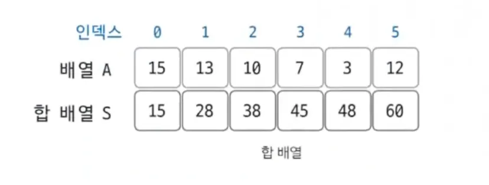
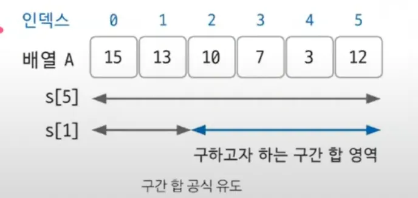

구간 합은 합 배열을 이용하여 시간복잡도를 더 줄이기 위해 사용되는 특수 목적의 알고리즘

## **구간 합(Prefix Sum)의 핵심 이론**

합 배열 S 정의

$$
S[i] = A[0] + A[1] + A[2] + \cdots + A[i-1] + A[i]
$$

합배열은 기존 배열을 전처리한 배열

시간 복잡도가 O(N)에서 O(1)으로 감소

### 합 배열을 만드는 공식

$S[i] = S[i-1] = A[i]$

i에서 j 까지의 구간합을 합배열을 통해서 구할 수 있다

예를 들어 A[2] 부터 A[5] 까지를 구한다면

S[5] - S[1]을 하면된다.

