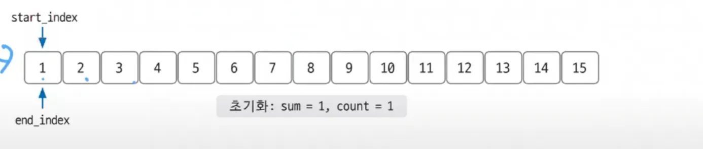
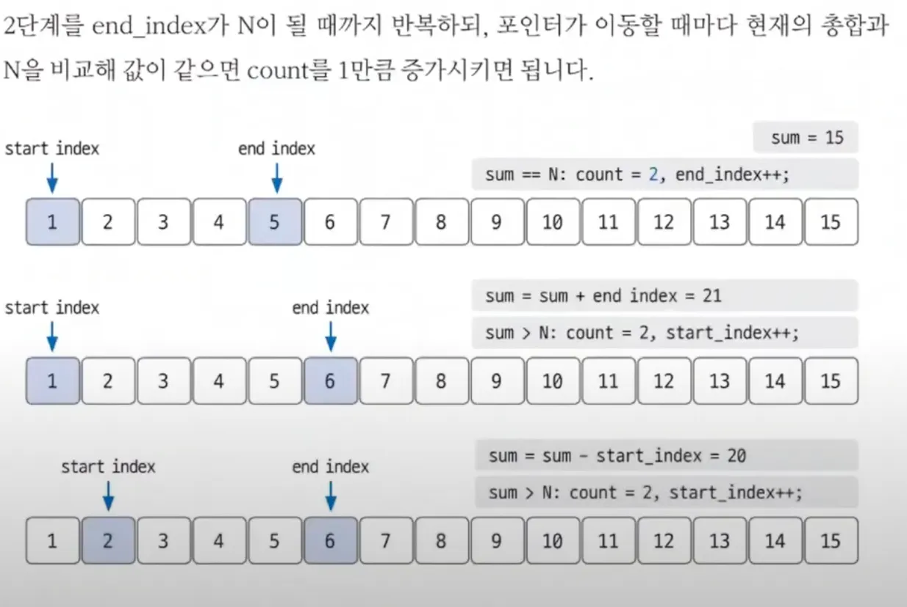

투 포인터는 2개의 포인터로 알고리즘의 시간 복잡도를 최적화한다

## 연속된 자연수의 합 구하기

어떠한 자연수 N은, 몇 개의 연속된 자연수의 합으로 나타낼 수 있다. 당신은 어떤 자연수 N(1 ≤ N ≤ 10,000,000)에 대해서, 이 N을 몇 개의 연속된 자연수의 합으로 나타내는 가지수를 알고 싶어한다. 이때, 사용하는 자연수는 N이하여야 한다.

예를 들어, 15를 나타내는 방법은 15, 7+8, 4+5+6, 1+2+3+4+5의 4가지가 있다. 반면에 10을 나타내는 방법은 10, 1+2+3+4의 2가지가 있다.

N을 입력받아 가지수를 출력하는 프로그램을 작성하시오.

입력
첫 줄에 정수 N이 주어진다.

출력
입력된 자연수 N을 몇 개의 연속된 자연수의 합으로 나타내는 가지수를 출력하시오

예제 입력 
15
예제 출력
4

### 1. 문제 분석하기

N 의 최대값이 10,000,000으로 매우 크게 잡혀있어서 이런 상황에서는 O(nlogn) 시간 복잡도 알고리즘 사용시 제한시간 초과하므로  O(n) 알고리즘 써야함, 이때 주로 투포인터를 사용

연속된 두 자연수의 합을 구해야하므로 시작인덱스와 종료인덱스를 지정하여 연속된 수를 표현

### 2. 손으로 풀어 보기

1. 입력받은 값을 N에 저장한 후 코드에서 사용할 변수를 모두 초기화

   결과 변수 count를 1로 초기화 하는 이유는 N이 15일때 숫자 15만 봅는 경우의 수를 미리 넣고 초기화 했기 때문

1. **포인터 이동 원칙 (핵심 로직)**

| sum > N | sum = sum - start_index; start_index++→ 현재 합이 너무 크므로, 왼쪽 값 제거 (범위를 줄임) |
| --- | --- |
| sum < N | end_index++; sum = sum + end_index;→ 합이 작으니, 오른쪽을 확장 |
| sum == N | end_index++; sum = sum + end_index; count++→ 경우의 수 1 증가 후, 오른쪽 확장 |

1. 그림으로 이해하기

### 3. 슈도코드 작성하기

<aside>
🧑🏻‍💻

N 변수 저장
사용 변수 초기화(**count = 1**, start_index = 1, end_index = 1, sum = 1)

while(end_index != N) {

    if(sum == N) count 증가, end_index 증가, sum값 변경
    else if(sum > N) sum값 변경, start_index 증가
    else if(sum < N) end_index 증가, sum값 변경
}
count 출력하기

</aside>

count = 1 초기화 이유는 자기자신 하나로 이루어진 경우의 수를 미리 저장하기 위해서