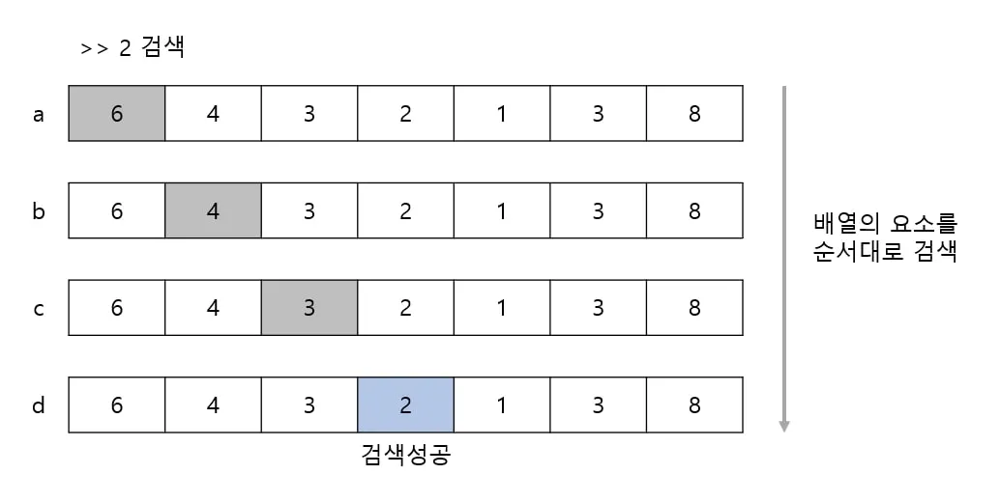
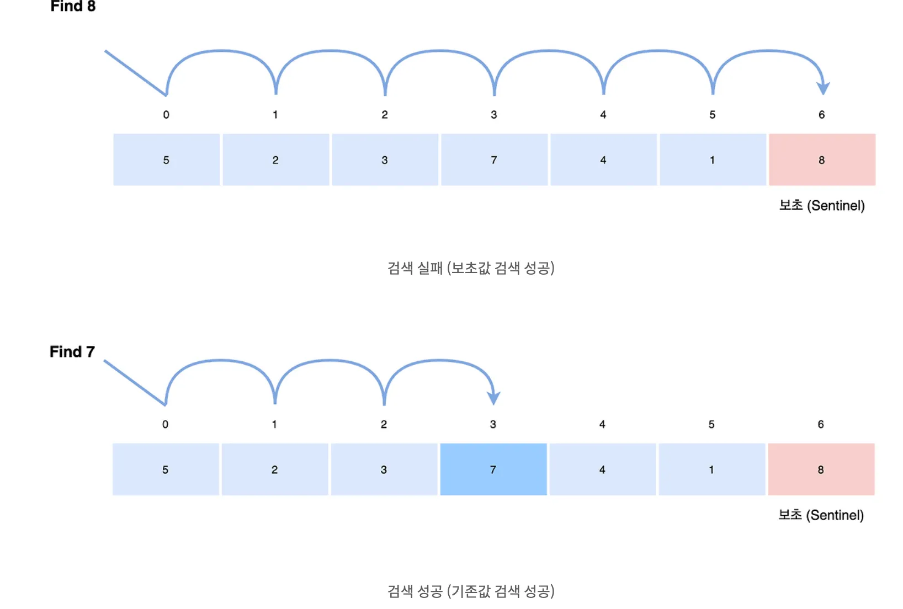

# 선형 검색

## 선형 검색이란?

- 요소가 직선 모양으로 늘어선 배열에서 검색은 원하는 키 값을 갖는 요소를 만날 때까지 맨 앞부터 순서대로 요소를 검색

- 배열 검색의 종료조건
    - 검색할 값을 발견하지 못하고 배열의 끝을 지났을때 (실패)
    - 검색할 값과 같은 요소를 발견한 경우(성공)

## 보초법

선형 검색은 두가지 종료조건을 모두 판단하는데 이 비용을 반으로 줄이는 방법이 보초법이다

- 검색하기전에 검색하고자 하는 키값을 맨 끝요소에 저장

- 원하는 값이 없어도 보초까지 검색하면 종료 조건이 성립 하므로 종료 판단횟수를 2회에서 1회로 줄임